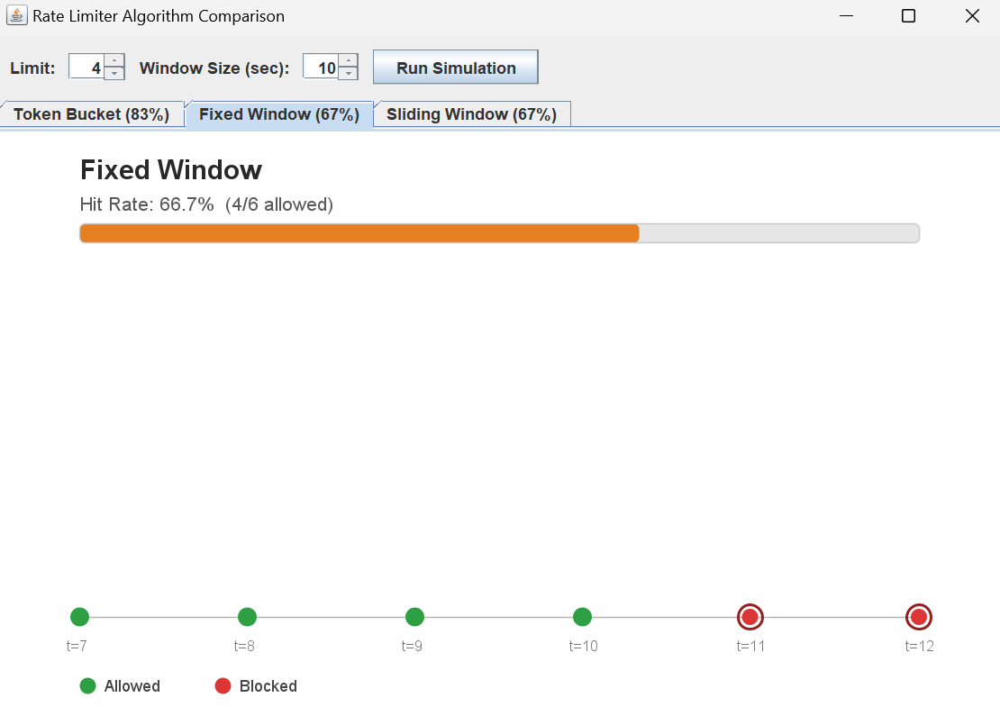
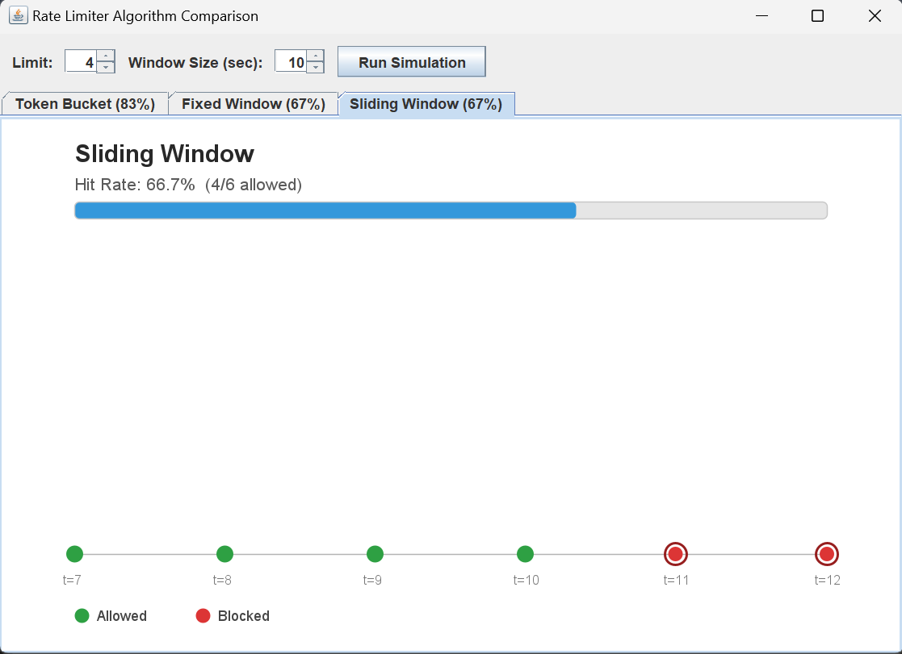
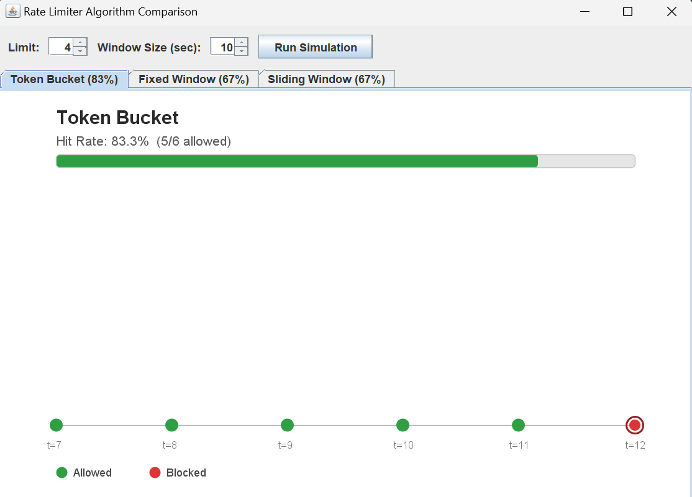

# Rate Limiter Simulator & Analyzer

A Java-based simulator that implements and compares three real-world API rate-limiting algorithms — **Fixed Window Counter**, **Sliding Window**, and **Token Bucket** — under identical traffic patterns, with an interactive Swing visualization showing exactly how and why each algorithm behaves differently.

## Why This Project?

Most rate limiter implementations online only build one algorithm. This project goes further: it implements all three major approaches used in production systems, deliberately demonstrates a well-known flaw in the simplest one (Fixed Window's boundary-burst issue), and visually compares all three side-by-side on the same request stream — turning a common interview topic into an actual analysis tool.

## Algorithms Implemented

| Algorithm | Core Idea | Data Structure Used |
|---|---|---|
| **Fixed Window Counter** | Counts requests in fixed, non-overlapping time blocks (e.g., [0-10s], [10-20s]) | Simple counter + window start timestamp |
| **Sliding Window** | Always looks at the last N seconds from the current moment, not a fixed block | Queue of request timestamps |
| **Token Bucket** | Each user has a bucket of tokens that refills over time; each request costs one token | Token count + last refill timestamp |

## The Boundary-Burst Flaw

Fixed Window has a well-known weakness: if requests cluster right around a window boundary, up to **2x the intended limit** can slip through (e.g., 5 requests just before a window ends, and 5 more just after it resets). This project's simulator deliberately demonstrates this exact scenario and shows how Sliding Window corrects it.


*Fixed Window allows a burst right at the reset boundary — Sliding Window (below) catches this correctly.*


*Sliding Window correctly blocks requests that Fixed Window would have let through, by always checking the true last-N-seconds window.*

## Design Highlights

- **`RateLimitStrategy` interface** — all three algorithms implement a common contract, so the manager class can treat them interchangeably (polymorphism), regardless of which algorithm a user is assigned.
- **`RateLimiter` manager class** — tracks each user independently using a `HashMap<String, RateLimitStrategy>`, so one user's traffic never affects another's limit.
- **Fair comparison fix** — Token Bucket's refill rate is dynamically scaled (`limit / windowSize`) to match the other two algorithms' effective rate, rather than using an arbitrary hardcoded value — ensuring the three-way comparison is apples-to-apples.

## Visualization

Running `RateLimiterVisualizer` opens an interactive window showing:
- A tab per algorithm, **auto-sorted by hit rate** (highest first)
- A live hit-rate progress bar per algorithm
- A green/red dot timeline of allowed vs. blocked requests, with hover tooltips
- Adjustable **limit** and **window size** inputs with a **Run Simulation** button to test different scenarios live


*Token Bucket tab, auto-selected by default here since it had the highest hit rate on this test data.*

## Tech Stack

Java, Object-Oriented Design (interfaces/polymorphism), Java Swing (custom-drawn `Graphics2D` visualization), Maven, Git/GitHub

## How to Run

```bash
git clone https://github.com/aaryanminocha2512-arch/rate-limiter-simulator.git
cd rate-limiter-simulator
# Open in IntelliJ IDEA, let Maven load, then run:
# RateLimiterVisualizer.java  -> interactive GUI
# RequestSimulator.java       -> console output comparing all 3 algorithms
```

## What I Learned

- How to design around a shared interface when the underlying algorithms have genuinely different configuration needs (and the trade-offs that come with forcing them into one contract)
- The practical difference between Fixed Window, Sliding Window, and Token Bucket — not just in theory, but by building and testing each one and observing them fail/succeed on the same data
- Debugging a fairness bug in my own simulation (Token Bucket's refill rate was hardcoded and always "won") — a good reminder to sanity-check that comparisons are actually apples-to-apples before trusting the results

## Author

Aryan Minocha